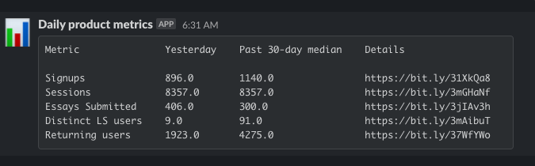

# Statsbot

Statsbot is a simple application to collect data from multiple sources and publish them as a simple table.
There are many ways to solve this problem, whether using off-the-shelf tools like SqlBot.co, or an AWS lambda function.
Unfortunately, I wasn't able to find a solution that allowed pulling data from multiple sources and defining the queries outside of the source code.
Lambdas come close, but they're still a bit too complicated for non-engineers to tinker with (without writing more or less the same amount of code as this program).

So, Statsbot exists to solve a very specific job.
Given a list of metrics that need to be published somewhere, make it easy to flexibly define the queries for those metrics.
It should be easy for developers to define a new type of datasource, and non-devs should be able to add a metric using any previously-defined source without requiring a recompliation.

## Core concepts

##### Report
Reports are stored in `.yaml` files.
They consist of several top-level keys followed by an array of `Row`s
The top level keys are:
1. `report_title` - pretty self explanatory. This is used as the Slack message's title
2. `history_window_days` - this kludge is simply for making the historical look-back column name prettier. It will likely be removed at some point.
3. `target_url` - the Slack webhook to publish the report to

##### Row
Each row contains all the information necessary to output a single row in a report.
Rows are rendered in the order they appear in the `.yaml` file.
They consist of the following keys, plus any source-specific details:
1. `type` - the type of source used for this row's data
2. `title` - self explanatory
3. `link` - each report row has a link to the "golden copy" data, which is typically a dashboard

##### Source
Sources are where a row's data comes from.
They're implemented as "plugins" within Statsbot, although currently the application needs to be recompiled when a new one is added.
Each source defines its own YAML syntax in order to retrieve all the config it may need.

Each source should expose a list of `(Float, UTCTime)` pairs. These will be aggregated to produce the report.

##### Connection Credentials
It goes without saying that storing sensitive values in plaintext source control is a very bad idea.
To help prevent folks from doing this, all connection strings should be configured as environment variables rather than raw strings.
This invariant is enforced by the source implementations.

### Supported source types
Statsbot supports the bare minimum datasources required for our use, but its trivial to add new ones.

#### PostgreSQL
Indicated via `type: psql`.
Keys:
- `connection:` - the name of the environment variable containing this row's PSQL connection string. The string must be in `libpq` format, not `jdbc`
- `query` - The full query for the report row. It must return two columns, `float4` & `timestamptz` respectively.

### Defining a new metric
To define a new metric, just copy+paste an existing one if the type already exists in the file.
Otherwise, provide all of the keys mentioned above for the source in question.
